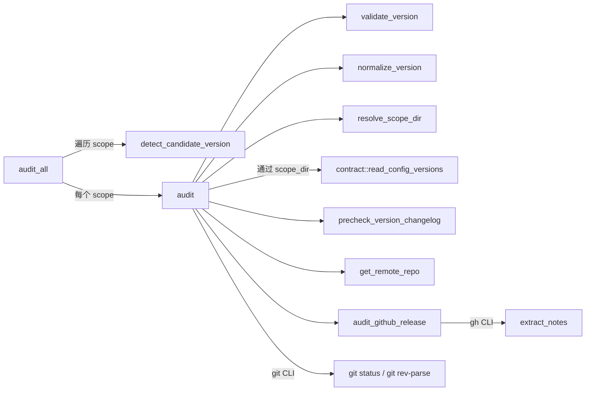
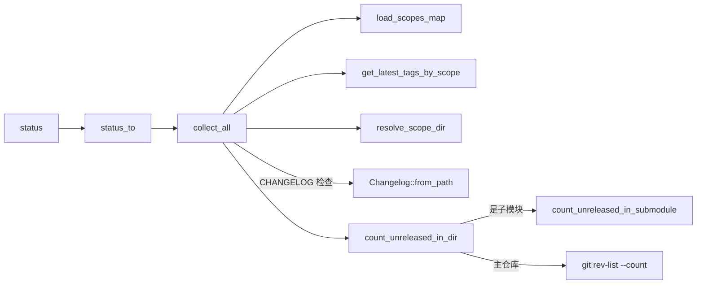
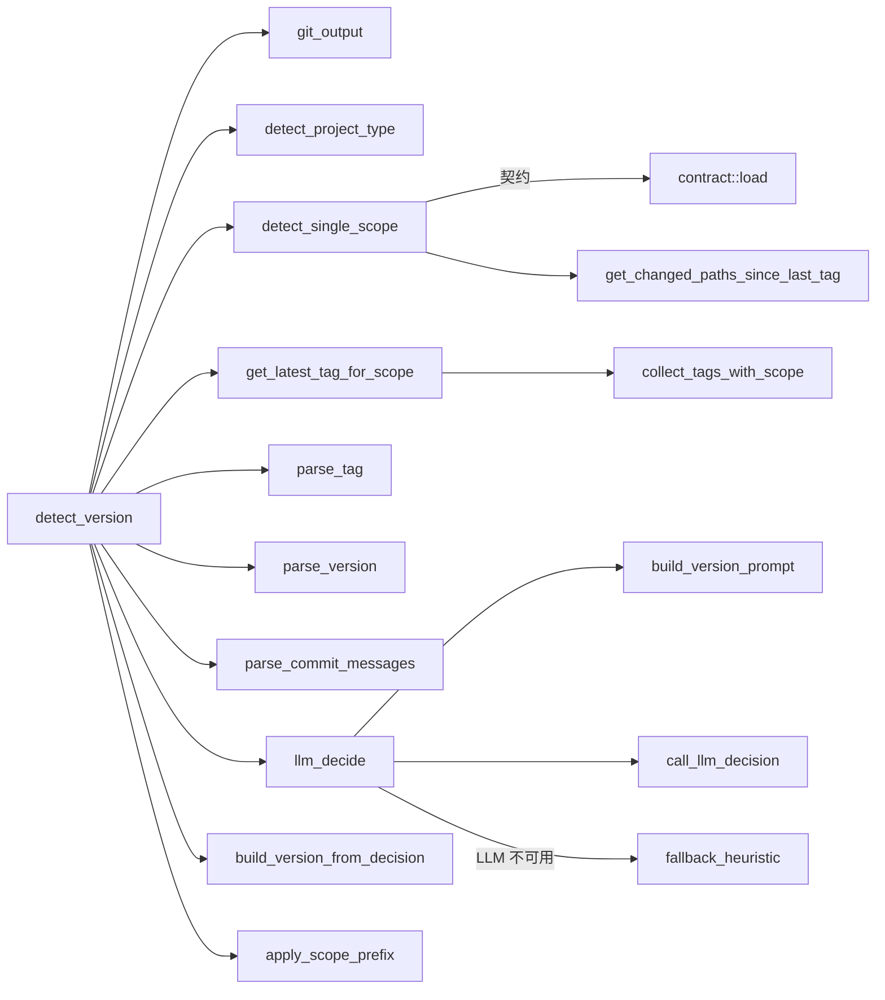
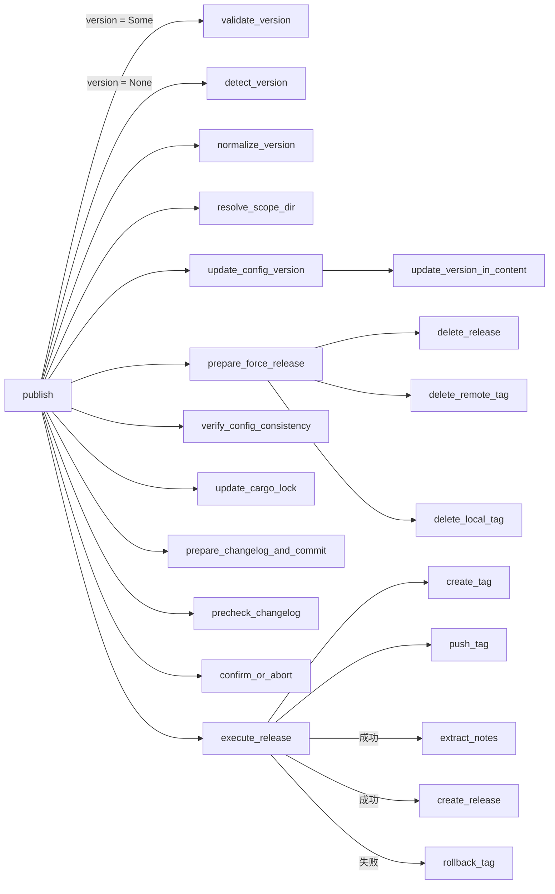
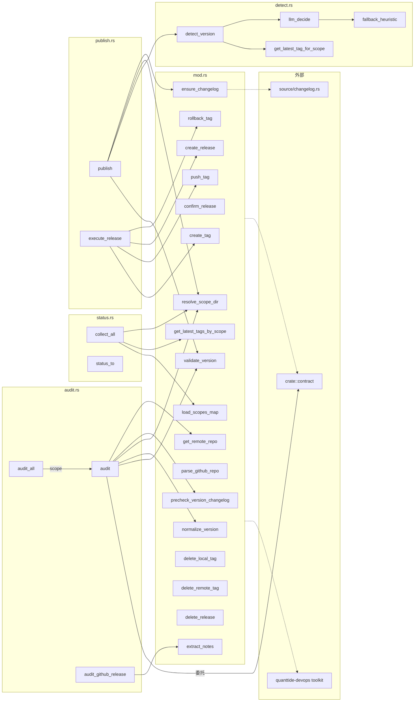

# release 模块依赖关系

> 模块文件：`src/cli/src/release/`
> 子模块：`mod.rs`（核心 util）、`audit.rs`、`status.rs`、`detect.rs`、`publish.rs`
> 外部依赖：`src/cli/src/source/changelog.rs`、`crate::contract`、`quanttide-devops` toolkit

## 模块文件一览

```
release/
├── mod.rs       — 工具函数（tag/git/gh/release 操作）+ re-exports
├── audit.rs     — 发布预检审计（6+1 项检查）
├── status.rs    — 发布状态查询（scope 级别的标签/提交/CHANGELOG）
├── detect.rs    — 版本号自动检测（LLM + fallback heuristic）
└── publish.rs   — 发布执行主流程
```

## 两层调用关系

每个函数标注 **可见性**（`pub` / `pub(crate)` / 无标记为 `private`）和 **调用方**。

---

### `mod.rs` — 工具函数

```
pub validate_version(version) → bool
  └─ 委托: crate::contract::validate_version

pub normalize_version(version) → String
  └─ 委托: crate::contract::normalize_version

pub precheck_version_changelog(version, changelog_path) → Vec<String>
  ├─ 调用: validate_version
  ├─ 调用: normalize_version
  └─ 依赖: quanttide_devops::source::changelog::Changelog::from_path

pub extract_notes(version, changelog_path) → Option<String>
  ├─ 调用: normalize_version
  └─ 依赖: quanttide_devops::source::changelog::Changelog::from_path

pub confirm_release(version, yes) → bool
  └─ 系统: stdin 读用户输入（yes 时跳过）

pub create_tag(version, repo_path) → bool
  └─ 系统: git2::Repository::open → reference("refs/tags/...")

fn tag_push_refspec(version) → String             ← private
  └─ 纯函数: 格式化 "refs/tags/{version}"

pub push_tag(version, repo_path) → Result<(), String>
  ├─ 调用: tag_push_refspec
  └─ 系统: git rev-parse --git-dir / remote get-url origin / git push

pub load_scopes_map(repo_path) → HashMap<String, String>
  └─ 委托: crate::contract::load_scopes

pub get_latest_tags_by_scope(repo_path) → Vec<(String, String)>
  └─ 依赖: quanttide_devops::source::git_tag::{GixTagSource, TagSource, parse_semver_tag}

pub resolve_scope_dir(version, repo_path) → PathBuf
  └─ 委托: crate::contract::load_scopes

pub get_remote_repo(repo_path) → Option<String>
  ├─ 依赖: gix::Repository::open → find_remote("origin")
  └─ 调用: parse_github_repo

pub parse_github_repo(url) → Option<String>       ← 纯函数
  └─ 字符串解析: 从 github.com URL 提取 "owner/repo"

pub create_release(version, notes, repo) → bool
  └─ 系统: gh release create --title --notes --repo

pub rollback_tag(version, repo_path) → bool
  ├─ 调用: delete_local_tag
  └─ 调用: delete_remote_tag

pub delete_local_tag(version, repo_path) → bool
  └─ 系统: git2::Repository::open → find_reference → delete

pub delete_remote_tag(version, repo_path) → bool
  └─ 系统: git push --delete origin {version}

pub delete_release(version, repo) → bool
  └─ 系统: gh release delete --yes --repo
```

---

### `audit.rs` — 发布审计

```
pub struct AuditItem
  ├─ name: &'static str
  ├─ passed: bool
  └─ detail: String

pub audit_all(repo_path, scope_filter) → Result<Vec<(String, Vec<AuditItem>)>, String>
  ├─ 委托: crate::contract::load
  ├─ 调用: detect_candidate_version (private)
  └─ 调用: audit

fn detect_candidate_version(repo_path, scope_name) → String   ← private
  ├─ 调用: super::detect::get_latest_tag_for_scope
  └─ 依赖: semver::Version::parse

pub audit(version, repo_path) → Result<Vec<AuditItem>, String>
  ├─ 调用: super::validate_version
  ├─ 调用: super::detect::detect_version                  (version = None 时)
  ├─ 调用: super::normalize_version
  ├─ 调用: super::resolve_scope_dir
  ├─ 调用: super::precheck_version_changelog
  ├─ 调用: super::get_remote_repo
  ├─ 调用: audit_github_release (private)
  ├─ 委托: contract::read_config_versions
  └─ 系统: git status --porcelain / git rev-parse refs/tags/...

fn audit_github_release(items, tag_exists, remote_name, version, changelog_path)
                                                          ← private
  ├─ 调用: super::extract_notes
  └─ 系统: gh release view --json body --jq
```

流程图：



---

### `status.rs` — 发布状态

```
pub use ReleaseState          ← 从 toolkit 重导出
pub use ReleaseStatus         ← 从 toolkit 重导出

pub collect_all(repo_path) → Vec<ReleaseState>
  ├─ 调用: super::load_scopes_map
  ├─ 调用: super::get_latest_tags_by_scope
  ├─ 调用: super::resolve_scope_dir
  ├─ 调用: super::normalize_version
  ├─ 依赖: Changelog::from_path (toolkit)
  └─ 调用: count_unreleased_in_dir (private)

pub status(repo_path)
  └─ 调用: status_to

pub status_to(writer, repo_path) → io::Result<()>
  └─ 调用: collect_all

fn count_unreleased_in_dir(repo_path, tag, scope_dir) → Option<usize>   ← private
  ├─ 调用: is_git_repo (private)
  ├─ 调用: count_unreleased_in_submodule (private)
  └─ 系统: git rev-list --count tag..HEAD

fn is_git_repo(path) → bool                                    ← private
  └─ 文件系统: path.join(".git").is_dir() || .is_file()

fn count_unreleased_in_submodule(submodule_path, tag) → Option<usize>
                                                              ← private
  └─ 系统: git rev-list --count tag..HEAD (在子模块目录内执行)
```

流程图：



---

### `detect.rs` — 版本检测

```
pub enum DetectError
  ├─ Git(String)
  ├─ Llm(String)
  ├─ Version(String)
  └─ Other(String)

pub struct DetectResult
  └─ version: String

pub detect_version(repo_path) → Result<DetectResult, DetectError>
  ├─ 调用: git_output (private)
  ├─ 调用: detect_project_type (private)
  ├─ 调用: detect_single_scope (private)
  ├─ 调用: get_latest_tag_for_scope (pub(crate))
  ├─ 调用: parse_tag (private)
  ├─ 调用: parse_version (private)
  ├─ 调用: parse_commit_messages (private)
  ├─ 调用: llm_decide (private)
  ├─ 调用: build_version_from_decision (private)
  └─ 调用: apply_scope_prefix (private)

fn git_output(args, repo_path) → Result<String, DetectError>   ← private
  └─ 系统: git {args}

fn parse_commit_messages(log_output) → Vec<String>            ← private
  └─ 纯函数: 字符串解析

struct VersionParts                                          ← private
  ├─ major, minor, patch: u32
  ├─ pre_stage: Option<String>
  └─ pre_num: Option<u32>

fn build_version_from_decision(has_tag, parts, decision) → String
                                                              ← private
  └─ 调用: build_version (private)

fn apply_scope_prefix(scope, version) → String               ← private
  └─ 纯函数: 格式化

struct LlmDecision                                           ← private
  ├─ action: String (patch/minor/major/skip/human)
  ├─ increment: Option<String>
  ├─ prerelease: Option<String>
  └─ reason: String

fn llm_decide(commits, latest_tag, project_type, scope)       ← private
  ├─ 调用: build_version_prompt (private)
  ├─ 调用: call_llm_decision (private)
  └─ 调用: fallback_heuristic (private, LLM 不可用时的兜底)

fn build_version_prompt(...) → String                        ← private
  └─ 纯函数: 字符串拼装

fn call_llm_decision(prompt) → LlmDecision                   ← private
  └─ 依赖: quanttide_agent::LLM

fn fallback_heuristic(commits) → LlmDecision                  ← private
  └─ 纯函数: 按 commit message 前缀判段

fn build_decision_from_flags(...)                              ← private
  └─ 纯函数: 辅助构建

fn build_version(parts, increment, prerelease) → String      ← private
  └─ 纯函数: 版本号拼接

fn detect_project_type(path) → String                        ← private
  └─ 文件系统: 检查 .git / src/ / Cargo.toml 等标志文件

fn detect_single_scope(path) → Result<Option<String>, DetectError>
                                                              ← private
  ├─ 委托: crate::contract::load
  ├─ 调用: get_latest_tag_for_scope
  └─ 调用: get_changed_paths_since_last_tag (private)

fn get_changed_paths_since_last_tag(repo_path, latest_tag) → Vec<String>
                                                              ← private
  └─ 系统: git diff --name-only tag..HEAD

pub(crate) get_latest_tag_for_scope(repo_path, scope) → Option<String>
  └─ 调用: collect_tags_with_scope (private)

fn collect_tags_with_scope(repo_path) → Vec<String>           ← private
  └─ 系统: git tag --list

fn parse_tag(tag) → (Option<String>, String)                  ← private
  └─ 纯函数: 从 "scope/vX.Y.Z" 拆出 scope 和版本字串

fn parse_version(ver_str) → (u32, u32, u32, Option<String>, Option<u32>)
                                                              ← private
  └─ 纯函数: 从 "X.Y.Z-pre.N" 拆解
```

流程：



---

### `publish.rs` — 发布执行

```
pub publish(version, repo_path, yes, force, dry_run, registry)
      → Result<(), Box<dyn std::error::Error>>
  ├─ 调用: super::validate_version              (version = Some 时)
  ├─ 调用: super::detect::detect_version        (version = None 时)
  ├─ 调用: super::normalize_version
  ├─ 调用: super::resolve_scope_dir
  ├─ 调用: update_config_version (private)
  ├─ 调用: prepare_force_release (private)
  ├─ 调用: verify_config_consistency (private)
  ├─ 调用: update_cargo_lock (private)
  ├─ 调用: prepare_changelog_and_commit (private)
  ├─ 调用: precheck_changelog (private)
  ├─ 调用: confirm_or_abort (private)
  └─ 调用: execute_release (private)

fn prepare_force_release(force, version, repo_path)           ← private
  ├─ 调用: super::get_remote_repo
  ├─ 调用: super::delete_release
  ├─ 调用: super::delete_remote_tag
  └─ 调用: super::delete_local_tag

fn verify_config_consistency(scope_dir, ver)                   ← private
  └─ 委托: contract::read_config_versions

fn update_cargo_lock(scope_dir)                                ← private
  └─ 系统: cargo generate-lockfile

fn prepare_changelog_and_commit(repo_path, scope_dir, version)
                                                              ← private
  ├─ 调用: super::ensure_changelog     (source/changelog.rs)
  └─ 系统: git add / git commit

fn precheck_changelog(version, scope_dir)                      ← private
  └─ 调用: super::precheck_version_changelog

fn confirm_or_abort(yes, version)                              ← private
  └─ 调用: super::confirm_release

fn execute_release(version, repo_path, registry)               ← private
  ├─ 调用: super::create_tag
  ├─ 调用: super::push_tag
  ├─ 调用: super::rollback_tag                   (push 失败时回滚)
  ├─ 调用: super::extract_notes
  ├─ 调用: super::get_remote_repo
  └─ 调用: super::create_release

fn update_config_version(repo_path, version)                   ← private
  └─ 调用: update_version_in_content (private)

fn update_version_in_content(content, new_ver) → String        ← private
  └─ 纯函数: 按行替换 version = "..." 和 "version": "..."
```

执行流程：



---

## 跨模块调用总图



## 外部依赖接口

release 模块依赖以下外部接口（非 `crate::` 前缀）：

| 外部来源 | 使用的函数/类型 |
|----------|----------------|
| `quanttide-devops` toolkit | `Changelog::from_path`、`GixTagSource`、`TagSource`、`parse_semver_tag`、`ReleaseState`、`ReleaseStatus` |
| `crate::contract` | `validate_version`、`normalize_version`、`load`、`load_scopes`、`read_config_versions`、`detect_languages` |
| `crate::source::changelog` | `ensure_changelog`、`ChangelogError` |
| `quanttide_agent` | `LLM::complete`、`Settings`、`CompleteOptions` |
| `git2` | `Repository::init` / `open` / `reference` |
| `gix` | `Repository::open` / `find_remote` |
| 系统命令 | `git`、`gh CLI`、`cargo generate-lockfile` |
